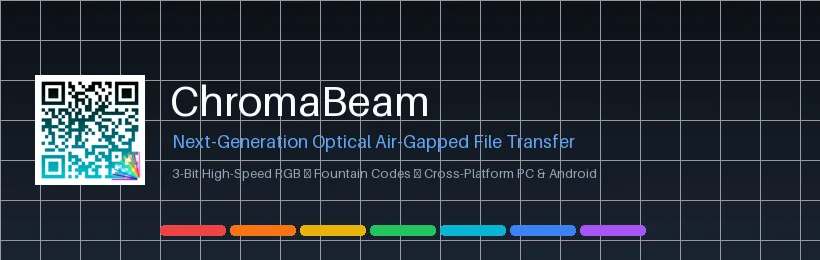

<p align="center">
  
</p>

# ChromaBeam — Ultra-High-Speed Air-Gapped Optical File Transfer

<p align="center">
  <a href="https://github.com/HenryCarm/ChromaBeam/releases"></a>
  <a href="https://github.com/HenryCarm/ChromaBeam/actions"></a>
  
  
</p>

<p align="center">
  
</p>

---

## Overview

**ChromaBeam** is an optical air-gapped file transfer protocol designed to overcome the physical bottlenecks of legacy monochrome QR streaming (which tops out at ~128 KB/s). 

By leveraging **3-bit RGB color multiplexing** and **Luby Transform (LT) Fountain Codes**, ChromaBeam delivers optical throughput of **350–550+ KB/s** across screens and camera lenses with zero physical cables, zero network access, and zero Bluetooth pairing.

---

## Key Advantages Over Standard QR Flashing

| Feature | Standard QR Streaming (TXQR / QRFileTransfer) | ChromaBeam |
|---|---|---|
| **Color Density** | 1-bit Monochrome (Black / White) | **3-bit RGB Multiplexing** (8 distinct optical states per module) |
| **Matrix Overhead** | Finder patterns & timing grids consume ~40% of the screen | **4 Scaled Corner Anchors** (92%+ screen payload density) |
| **Packet Loss Resilience** | Dropped frames cause transmission stall or huge Reed-Solomon buffers | **Luby Transform Fountain Codes** (collect any $K(1+\epsilon)$ droplets in any order) |
| **Decoding Latency** | Complex 2D barcode decode (~15–30 ms per frame) | **Instant Homography Perspective Warp & Center Sampling** ($<2$ ms per frame) |
| **Throughput** | ~80–120 KB/s @ 30 FPS | **350–550+ KB/s @ 60 FPS** |

---

## Protocol Binary Frame Specification

```
+----------------+----------------+----------------+----------------+-------------------+----------------+
|  Magic (2B)    |  File ID (2B)  | Total Blocks K |  Droplet Seed  |  Payload Bytes    |  CRC32 (4B)    |
|  0x43, 0x42    |  uint16_be     | uint16_be (2B) | uint32_be (4B) |  XOR'd Block Data | IEEE 802.3     |
+----------------+----------------+----------------+----------------+-------------------+----------------+
```

- **Magic Bytes (`0x43, 0x42` - "CB")**: Instantly filters background noise, desktop wallpaper textures, and reflections.
- **Droplet Seed**: Feeds a synchronized 32-bit PRNG (`Mulberry32`) across Python and JavaScript to sample degree $d$ from the Robust Soliton distribution.
- **CRC32**: Validates payload integrity, discarding motion-blurred or rolling-shutter frames prior to Gaussian elimination.

---

## Optical RGB Color Encoding

| 3-Bit Value | Red (R) | Green (G) | Blue (B) | Visual Color | Hex |
|:---:|:---:|:---:|:---:|:---:|:---:|
| `000` | 0 | 0 | 0 | **Black** | `#000000` |
| `001` | 0 | 0 | 255 | **Blue** | `#0000FF` |
| `010` | 0 | 255 | 0 | **Green** | `#00FF00` |
| `011` | 0 | 255 | 255 | **Cyan** | `#00FFFF` |
| `100` | 255 | 0 | 0 | **Red** | `#FF0000` |
| `101` | 255 | 0 | 255 | **Magenta** | `#FF00FF` |
| `110` | 255 | 255 | 0 | **Yellow** | `#FFFF00` |
| `111` | 255 | 255 | 255 | **White** | `#FFFFFF` |

---

## Quick Start & Usage

### 1. Launch Desktop Application (PySide6)
To launch the desktop transmitter and receiver on Linux or Windows:

```bash
/home/henry/Documents/Projects/Python/venv/bin/python desktop_app.py
```

### 2. Launch Universal Mobile / Web App (Zero Install)
To beam to any mobile phone without installing an app:

```bash
/home/henry/Documents/Projects/Python/venv/bin/python web/server.py
```
- Open `http://<YOUR_LAN_IP>:8080` in Chrome, Safari, Brave, or Firefox.
- Switch to the **"Optical Receiver"** tab and tap **"START CAMERA RECEIVER"**.
- Aim at the sender screen $\rightarrow$ droplets assemble $\rightarrow$ file saves automatically!

### 3. Build & Deploy Hub (GUI)
To monitor cloud builds and install the Android `.apk` via ADB with one click:

```bash
/home/henry/Documents/Projects/Python/venv/bin/python build_monitor_gui.py
```

---

<p align="center">
  
</p>
